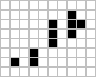

# greehill Frontend Developer Assignment

Welcome to this round of your interview process. Let me introduce you the **most awesome assignment humankind has ever created**! Really. There is no exaggeration in it. I hope you will enjoy working on it. `◕ ◡ ◕`

## The Game

You will implement nothing less but **The Game of Life** itself! Game of Life is a zero-player game created by a British mathematician called John Horton Conway in 1970.

In the game you have a **universe** which is a two-dimensional orthogonal grid of square **cells**. Cells has two states: they are either **alive** or **dead**. Like this:

We start with **an initial pattern** (seed), and afterwards, as time passes, **generations** (iterations) will follow each other. As we go to the next generation, cells can **come alive** or **die**, depending on their 8 neighbours and some rules, resulting in a simulation like this:

Here are the rules copied from Wikipedia:

> - Any live cell with fewer than two live neighbours dies, as if by underpopulation.
> - Any live cell with two or three live neighbours lives on to the next generation.
> - Any live cell with more than three live neighbours dies, as if by overpopulation.
> - Any dead cell with exactly three live neighbours becomes a live cell, as if by reproduction.

Lots of words, yes. You can definitely formulate the same rules in a simpler manner, it's up to you. Also, you can read more about the game, the **still lifes**, **oscillators** and even **spaceships** 🚀 on [Wikipedia](https://en.wikipedia.org/wiki/Conway's_Game_of_Life).

## Your task

Your task is to **create a web app** that shows us the undecidability of the Game of Life. We'd like to play around by setting up initial patterns, run the simulation and see if the civilization we created will prosper and conquer all the 🌌 galaxies 🪐 with spaceships 🚀, or... become extinct 🪦.

### Overview

- It should be a **React app**. We prefer **functional components** and **hooks**.
- You can choose the graphical representation of the cells. You can go with `grid`, `svg`, `canvas`, `threeJS` or any other solution you come up with.
- Please write **clean code** with a quality you'd push to your workplace's repo.
- **Tests are very welcome!** You don't need to take a tremendous time to implement flaky UI tests, but you can notice that the calculation of the next generation is a pure function which is quite easy to test. Or even implement with **TDD**. ;-)
- Please use `git`. Reasonable sized commits with reasonable commit messages are preferred (not mandatory), so we can see how you've worked your way towards the result.
- After you've finished, please push your repo to any mainstream hosting service (**GitHub, GitLab, Bitbucket**), and send it to us. If you concerned about making your repo public, you can keep it private. Please use GitHub or GitLab, and add @Ozonid and @gergooo as collaborators.
- It's not a small task, but you might be able to finish the assignment in 8-12 hours.

### Requirements

- 30x30 cells at minimum, surrounded by buttons.
- Indicators show the generation number and the size of population.
- **Initial state (0th generation):**
  - Initial state (0th generation) can be set by clicking on cells, **toggling their state**,
  - the cell states can be **cleared** with a button.
- **Running (>0th generations):**
  - Simulation can be **played** (started) and **paused**,
  - **stepped forward** with one step,
  - and **reset** to initial state (0th generation), where you can modify your initial state to have a different outcome. Please note, that reset doesn't clear the board.
- _Optional (really, only if you are bored):_
  - _Simulation speed could be selectable._
  - _Aesthetics. You can definitely go past standard gray buttons._
  - _You can even add selectable color themes._
  - _You can add a `Random` button for randomizing the initial state,_
  - _or add selectable built-in patterns (e.g. spaceship 🚀),_
  - _or even combining the two!_
  - _And if you are really, really bored, you can add a `step backward` button._ `¯\(◉◡◔)/¯`

**Thank you a lot for your time, and have fun with the project! We can't wait to see your work! `{´◕ ◡ ◕｀}`**
